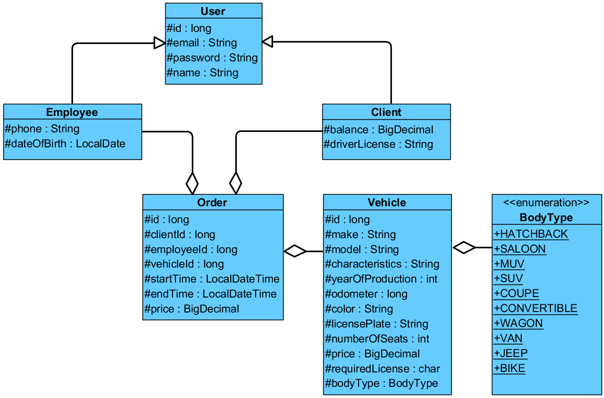

# Vehicle Rental Agency. Collections

The purpose of this exercise is to check your knowledge of the Java collections framework and your ability to use it on practical tasks. 

Duration: **1** hour


## Description

In this exercise, you will implement "Vehicle Rental Agency" to allow users to filter and sort vehicles and information about orders in a variety of ways. 
The class diagram of the Domain model is shown in the figure below:



You are also given a description of the following interfaces and class:  
* The `Sort` interface allows vehicles to be sorted by identifier, year of production, and odometer reading.  
* The `Find` interface allows users to search for and filter vehicles and orders based on various criteria.  
* The `Agency` class determines the functionality of the vehicle rental agency.  


First, proceed to the Domain model classes and implement their content.  

Then, proceed to the `Agency` class, which contains lists of the `Vehicle` class and the `Order`       class, and also implements the `Sort` and `Find` interfaces. You need to implement the following methods of the `Agency` class:


* `public void addVehicle(Vehicle vehicle)`  
Adds a vehicle to the list of vehicles

* `public void addOrder(Order order)`  
Adds an order to the list of orders  

* `Set<String> findMakers()`  
Returns a set of the vehicle makes the agency has in its fleet  

* `Set<BodyType> findBodytypes()`  
Returns a set of the body types of the vehicles in the agency's fleet  

* `Map<String, List<Vehicle>> findVehicleGrouppedByMake()`  
Returns a map in which the key is the make of the vehicle, and the value is a list of the vehicles of a given make that the agency has in its fleet  

* `List<Client> findTopClientsByPrices(List<Client> clients, int maxCount)`  
Calculates the total order amount for each client and then returns the maxCount of the clients with the highest amount. If the total number of clients is less than maxCount, a list of all the clients is returned  

* `List<Client> findClientsWithAveragePriceNoLessThan(List<Client> clients, int average)`  
Calculates the average number of orders for each client and returns a list of clients whose average order amount is not less than the average  

* `List<Vehicle> findMostOrderedVehicles(int maxCount)`  
Calculates how many times each vehicle in the fleet has been ordered and then returns the `maxCount` of vehicles ordered most frequently. If the total number of vehicles is less than maxCount, a list of all the vehicles is returned  

* `List<Vehicle> sortByID()`  
Returns all vehicles sorted by id as a new list  

* `List<Vehicle> sortByYearOfProduction()`  
Returns all vehicles sorted by _yearOfProduction_ as a new list  

* `List<Vehicle> sortByOdometer()` 
Returns all vehicles sorted by _odometer_ as a new list  
   

### Details

* Domain model classes must have the following:
     * A default constructor
     * A constructor that takes values to initialize all fields as parameters
    * Getters and setters for all fields
    * The `equals()`, `hashCode()`, and `toString()` methods 

> Note: In the future, it is expected that objects of these classes will be transferred over a network or stored in a file or database.  

* The string representation of an object of these classes must follow the following convention:
```java
Class_name{field1_name=field_value, field2_name=field_value,...}
```
* If a class inherits another class, it must include inherited fields before its own fields:  
```java
Class_name{parent_class_fields, own_fields}
```
* String values must be surrounded by apostrophes. For example: `text='value'` 
* If a field is a collection or an array, its value must be surrounded by square brackets.
* Fields must be ordered as denoted in the UML class diagram.

## An example of a string representation  

Let class A have the following description:  
```
class A {
    private int p = 10;
    protected int a = 1;
    protected String s = "a string";
    // ...
}
``` 
The string representation of the object will be as follows:  

```
A{p=10, a=1, s='a string'}
```

Let class B be the inheritor of class A and have the following description:
```
class B extends A {
    private int b = 5;
    private String t = "a text";
    private char[] chars = {'a', 'b'};
    // ...
}
```
The string representation of the object will be as follows:
```
B{a=1, s='a string', b=5, t='a text', chars=[a, b]}
```
### Restrictions
You may not use lambda expressions or streams.

"# Java-tasks-" 
